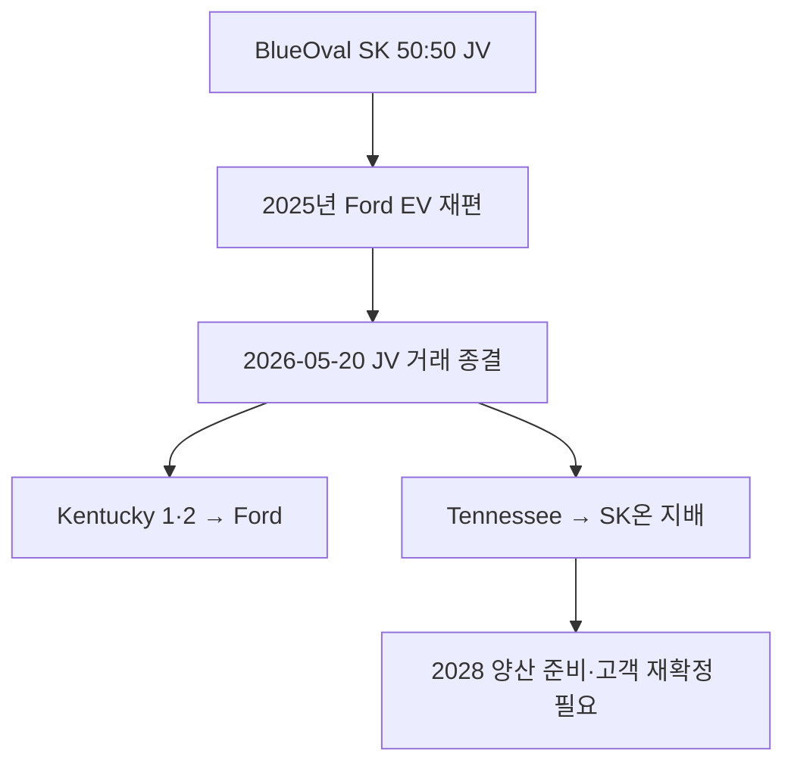

> SK온 · D09 고객·수주·OEM 관계 · SK온 D09 — Customers, Orders & OEM Relationships

## D09-02 Current Customer & Program Ledger

### 1. 고객관계 요약

| 관계 ID | 고객·고객군 | 공개 확인 범위 | 기준일 상태 | 핵심 미확인 |
|---|---|---|---|---|
| `REL-D09-HMG-001` | 현대자동차그룹: Hyundai·Kia·Genesis | 전략적 고객관계, IONIQ 5·EV6·GV60 공급이력, HSBMA의 HMG용 Cell과 초기 IONIQ 9 지원 | `CURRENT_CONFIRMED` | 브랜드·차종별 연간 GWh, HSBMA Line별 배정 |
| `REL-D09-VW-001` | Volkswagen Group | 2026년 1~4월 SK온 Cell 설치 고객군; Commerce–ID.4 생산이력 | `CURRENT_CONFIRMED_WITH_SITE_GAP` | 유럽·중국·미국 현재 차종별 공장·물량 |
| `REL-D09-MB-001` | Mercedes-Benz | 2026년 1~4월 주요 설치 고객군으로 확인 | `CURRENT_CONFIRMED_WITH_PROGRAM_GAP` | 계약기간·차종·Cell·공장·물량 |
| `REL-D09-FORD-001` | Ford | 2026년 초 설치 고객군이나 BlueOval SK 해소, Kentucky 이전, 현세대 F-150 Lightning 종료가 동시 발생 | `CURRENT_TRANSITION` | 잔존 차종·지역·2026 이후 구매조건·Tennessee 관계 |
| `REL-D09-NISSAN-001` | Nissan | 2028~2033년 미국산 High-Nickel Pouch 약 100GWh 공급계약 | `FUTURE_BINDING` | SK온 생산공장·연도별 GWh·Line·가격식 |
| `REL-D09-SLATE-001` | Slate | 2026~2031년 미국산 High-Nickel NCM 약 20GWh, 추가물량 option | `FUTURE_BINDING_STARTUP_RISK` | 연도별 Call-off·생산공장·SOP Ramp·option 행사 |
| `REL-D09-FLATIRON-001` | Flatiron Energy Development | Massachusetts 프로젝트용 1GWh LFP ESS 확정, 추가 6.2GWh 프로젝트 우선협상 범위 | `FRAMEWORK_PARTLY_BINDING` | 첫 출하·수락, 추가 프로젝트 전환율·수익성 |

현대차그룹은 2023년 공식 발표에서 SK온과의 기존 전략적 관계와 IONIQ 5·Kia EV6·Genesis GV60 공급이력을 명시했고, 미국 JV는 Hyundai·Kia·Genesis EV를 지원하도록 설계됐다. 2026년 6월 상업생산을 시작한 HSBMA의 초기 Cell은 IONIQ 9를 지원한다. ([현대차그룹](https://www.hyundaimotorgroup.com/en/news/CONT0000000000089410), [HSBMA 발표](https://www.hyundainews.com/releases/4876))

2026년 1~4월 비중국 시장 설치자료에서는 SK온의 주요 고객으로 현대차그룹·Ford·Volkswagen·Mercedes-Benz가 확인된다. SK온은 12.3GWh를 기록해 전년 동기보다 7.8% 감소했고, 해당 자료는 Ford·Volkswagen의 판매둔화를 주요 영향으로 설명한다. 다만 설치자료만으로 고객별 계약량과 매출비중은 계산할 수 없다. ([SNE Research](https://www.sneresearch.com/en/insight/release_view/665/page/0))

### 2. 북미 신규 수주 원장

| Agreement ID | 고객 | 확정/발표량 | 기간 | 제품·원산지 | 운영 판정 |
|---|---:|---:|---:|---|---|
| `AGR-D09-NISSAN-2025` | Nissan | nearly 100GWh | 2028~2033 | 미국산 High-Nickel Pouch | 계약은 확정, 공장·연도별 배정은 `UNKNOWN` |
| `AGR-D09-SLATE-2025` | Slate | 약 20GWh + 추가 option | 2026~2031 | 미국산 High-Nickel NCM | 기본 공급과 option을 분리 |
| `AGR-D09-FLATIRON-2025-A` | Flatiron | 1GWh | 2026년 하반기부터 | 미국산 LFP Containerized BESS | 확정 공급분 |
| `AGR-D09-FLATIRON-2025-B` | Flatiron | 추가 6.2GWh 후보 | ~2030 | 미국산 LFP BESS | 우선협상권; 확정수주 합산 금지 |

Nissan 계약은 약 100GWh 총량과 Canton, Mississippi에서 생산될 차세대 EV용이라는 사실까지만 확인된다. SK온 생산공장은 공개되지 않았다. ([SK–Nissan](https://eng.sk.com/news/sk-on-signs-battery-supply-agreement-with-nissan))

Slate 계약은 약 20GWh의 미국산 Cell을 2026~2031년 공급하고 추가물량 option을 포함한다. 스타트업의 차량 Ramp와 SK온의 연도별 출하량은 별도 검증해야 한다. ([SK–Slate](https://eng.sk.com/news/sk-on-selected-as-battery-supplier-for-u-s-ev-startup-slate))

Flatiron 발표는 최대 7.2GWh Framework로 표현됐지만 후속 실적자료는 **1GWh 계약 + 6.2GWh 우선협상권**으로 구체화했다. D09의 확정 수주량은 1GWh로, 6.2GWh는 pipeline으로 관리한다. ([SK Innovation 최초 발표](https://askinno.com/global/archives/21955), [2025년 3분기 실적](https://askinno.com/global/archives/22126))

### 3. Ford 관계의 상태 변경

Ford는 2025년 12월 현세대 F-150 Lightning 생산 종료와 일부 EV 프로그램 취소를 발표했고, 2026년 5월 20일 JV 해소 거래가 종결됐다. Kentucky 두 공장은 Ford가 인수했고 Tennessee는 SK온 측에 남았다. 따라서 Ford를 단순 `종료 고객`으로 처리해서도, 과거 JV 계획을 그대로 `미래 확정 수요`로 연장해서도 안 된다. ([Ford 2025 EV 재편 8-K](https://www.sec.gov/Archives/edgar/data/37996/000003799625000238/f-20251209.htm), [Ford 2026 거래종결 8-K](https://www.sec.gov/Archives/edgar/data/37996/000003799626000093/f-20260520.htm), [SK On Tennessee](https://eng.sk.com/news/sk-on-tennessee-becomes-newest-sk-on-u-s-company))

### 4. 현재 공개정보로 계산할 수 없는 것

- 고객별 매출·GWh·Gross Margin·수주잔고 비중
- Volkswagen·Mercedes-Benz의 차종–Cell–공장 매핑
- Ford의 2026년 이후 유효 공급계약·차종별 잔량
- Nissan·Slate의 SK온 생산공장과 연도별 Nomination
- HSBMA 35GWh 중 차종·브랜드·Line별 고객승인 Capacity
- Flatiron 추가 6.2GWh의 계약 전환율과 프로젝트별 COD

---
